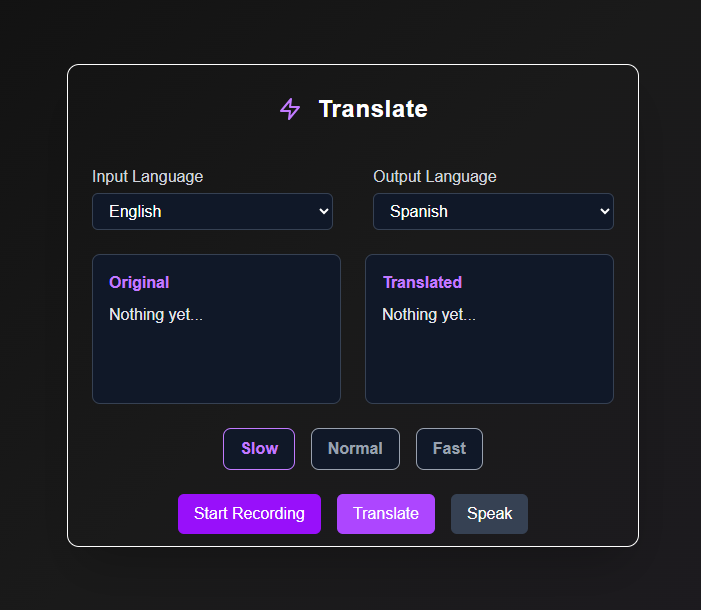

# 🌍 Language Translator with Speech Features

A React-based language translation web application that allows users to:

- Convert speech to text in the selected language.
- Translate text between multiple languages using the Deep Translate API.
- Read the translated text aloud using Text-to-Speech (TTS).
- Adjust speaking speed (Slow, Normal, Fast).
- Fully responsive UI with intuitive controls.

---

## ✨ Features

- **🌐 Text Translation** – Translate any input text between supported languages.
- **🎙️ Speech Recognition** – Speak in one language and get the transcription in real-time.
- **🔄 Text-to-Speech** – Hear the translated text in the target language.
- **🎛️ Speaking Speed Control** – Choose between Slow, Normal, and Fast speech.
- **📊 Language Selection** – Choose both source and target languages from a dropdown list.
- **⛓️‍💥 Instant Feedback** – Works in the browser without any backend setup.

---

## 🛠️ Tech Stack

- **Frontend:** React.js, Vite
- **Styling:** Tailwind CSS
- **API:** [Deep Translate API](https://rapidapi.com/gatzuma/api/deep-translate1) | [Text to Speech API](https://rapidapi.com/elisbushaj2/api/text-to-speach-api)
- **Browser APIs:** Speech Synthesis API, Speech Recognition API
- **AI Tool:** Chat GPT for assistance and faster development
- **Security Consideration:** Implement a separate backend to protect API keys, logics in it.

---

## 📦 Installation Instructions

### 1️⃣ Clone the repository

```bash
git clone https://github.com/your-username/translator-app.git
cd translator-app
npm install
npm start
```

### 2️⃣ Install Dependencies

```bash
npm install
```

### 3️⃣ Setup Environment Variables

Create a <b>.env</b> file in the root with:

```bash
VITE_API_KEY='your-api-key'
VITE_TRANSLATE_API_URL='https://deep-translate1.p.rapidapi.com/language/translate/v2'
VITE_TRANSLATE_API_HOST='deep-translate1.p.rapidapi.com'
VITE_SPEACH_API_URL='https://text-to-speach-api.p.rapidapi.com'
VITE_SPEACH_API_HOST='text-to-speach-api.p.rapidapi.com'
```

### 4️⃣ Start Development Server


```bash
npm run dev
```
The app will be accessible at [http://localhost:5173](http://localhost:5173)

---

## 🚀 Usage

```bash
1. Select source and target languages.
2. Type or speak your text.
3. Click "Translate" to see the translated result.
4. Use the "Play" button to listen to the translation.
5. Adjust the speaking speed using the speed selector.
```

---

## 🌐 Live Demo

```bash
https://moheeb-khan-translation-app.vercel.app
```

---

## 📷 Screenshot



---

## 📂 Project Structure

```plaintext
translator-app/
│── public/
│   ├── project-image.png                 # project image
│── src/
│   ├── components                          # UI Components (Controls, Header, Language Selector, etc.)

│   └── config                                  # API configuration (URLs, Keys)
│   └── styles                                  # CSS styling
│   └── utils                                    # Helper functions and API calls
│   ├── App.jsx
│   ├── main.jsx
│   ├── index.css
├── package.json
└── README.md
└── .env                                           # Environment variables
└── .gitignore
└── vite.config.js
```

---

## 📡 API Reference

### 1️⃣ Available Language API (Text-to-Speatch API)

```bash
Endpoint: https://text-to-speach-api.p.rapidapi.com/supported-languages
Method: GET
Headers:
  X-RapidAPI-Key: YOUR_API_KEY
  X-RapidAPI-Host: text-to-speach-api.p.rapidapi.com
```

### 2️⃣ Translation API (Deep Translate API)

```bash
Endpoint: https://deep-translate1.p.rapidapi.com/language/translate/v2
Method: POST
Headers:
  X-RapidAPI-Key: YOUR_API_KEY
  X-RapidAPI-Host: deep-translate1.p.rapidapi.com
Body:
{
  "q": "Hello world",
  "source": "en",
  "target": "es"
}
```

### 3️⃣ Speech APIs

#### Speech Recognition API

```javascript
const recognition = new window.SpeechRecognition();
recognition.lang = "en-US";
recognition.start();
```

#### Text-to-Speech API

```bash
Endpoint: https://text-to-speach-api.p.rapidapi.com/text-to-speech
Method: POST
Headers:
  X-RapidAPI-Key: YOUR_API_KEY
  X-RapidAPI-Host: text-to-speach-api.p.rapidapi.com
Body:
{
 "text": "Hello world",
  "lang": "en",
  "speed": "slow" # slow | normal | fast
}
```

---

## 👨‍💻 Author

Developed with 💙 by [Moheeb Khan](https://github.com/moheebk123)

---

> For any queries or issues, feel free to raise an issue or contact via GitHub.
